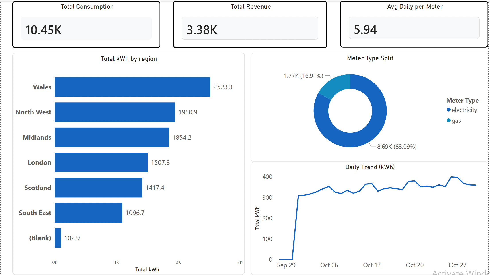
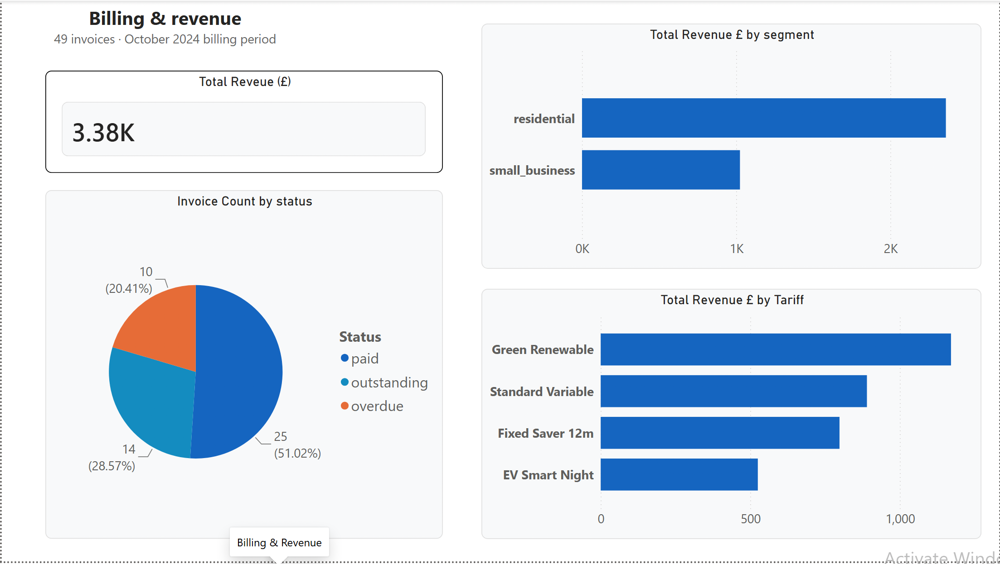
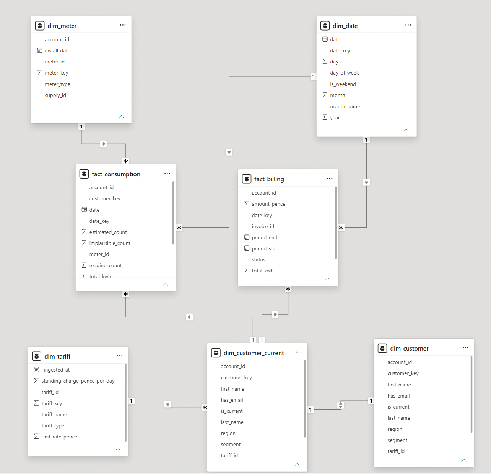
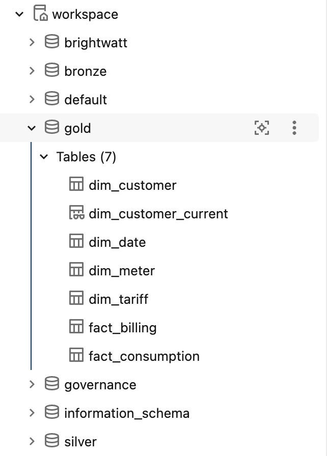

# UK Energy Supplier — Lakehouse BI Platform

An end-to-end **Business Intelligence & Data Engineering** project built on free-tier tooling,
modelling a fictional UK residential energy supplier. It takes messy, multi-format source data
through a **medallion lakehouse** (bronze → silver → gold) into a governed **star schema** ready
for analytics — with the data-quality, governance and modelling rigour expected of a senior role.

> Built to demonstrate the full Senior BI Analyst stack: Databricks (Spark, Delta Lake, Unity
> Catalog), Python ELT, dimensional modelling, data-quality governance, Power BI, and CI/CD.

---

## Dashboards


*Consumption Overview — regional kWh breakdown, daily trend, meter type split*


*Billing & Revenue — invoice status, revenue by tariff and segment*

## Data platform


*Power BI semantic model — star schema with SCD2 dim_customer and surrogate keys*


*Unity Catalog — bronze/silver/gold medallion architecture with governed tables*

---

## Why this project is different

Most portfolio pipelines run on clean, friendly data. This one ships with a **synthetic data
generator that injects 11 realistic data-quality defects** (duplicates, nulls, negative readings,
schema drift, orphan records, late arrivals, and more) and records every defect in a
**ground-truth manifest**. That means the data-quality layer isn't just asserted — it's
**reconciled against known truth**:

> *"Caught 127 of 127 orphan readings; duplicate count exceeds injected because late-arriving
> reads collide on the same meter-timestamp key."*

Being able to **explain every difference** is the difference between *"I cleaned the data"* and
*"I can prove my cleaning is correct."*

---

## Architecture

```
 Raw sources            BRONZE                SILVER                  GOLD
 (CSV + JSON,    ──►  faithful raw   ──►  cleaned, typed,    ──►  star schema
  32 daily files       copy (Delta)        validated, quarantined   (facts + dims,
  + schema drift)      + lineage           + drift conformed         surrogate keys, SCD2)
                                                                          │
                                                  reconciled vs           ├─► SQL Server mart  (planned)
                                                  ground-truth manifest   └─► Power BI          ✓ done

 Governance: Unity Catalog · GDPR masking · RLS   |   DevOps: Git · Azure DevOps CI/CD (planned)
```

**Domain:** half-hourly smart-meter readings + customer billing for ~thousands of homes.
Half-hourly data gives Spark-scale volume; customer PII drives the GDPR/RLS story; invoices feed
paginated reporting; meter faults feed the ML anomaly POC.

---

## What's built

| Layer | Highlights |
|---|---|
| **Bronze** | All formats landed faithfully as Delta (CSV folder ingest, multiLine JSON, isolated schema-drift batch); audit columns (`_ingested_at`, `_source_file`) for lineage; zero-loss reconciliation |
| **Silver** | Type casting, dedup on natural key, **quarantine-don't-delete** with tagged reject reasons, schema-drift conformance, region standardisation, **DQ reconciliation vs ground-truth manifest** |
| **Gold** | Dimensional **star schema** (`fact_consumption`, `fact_billing` + `dim_customer/meter/tariff/date`), **surrogate keys**, **SCD2** history-tracking dimension with **point-in-time fact attribution** |
| **Governance** | Unity Catalog **column masking** on PII (email, postcode); **GDPR right-to-erasure** — cross-layer DELETE across 16 tables, scheduled VACUUM to purge Delta history, audit log |
| **Reporting** | Power BI **semantic model**, DAX measures, **RLS by region**, two dashboard pages; **paginated billing statement** via Report Builder connected to the published semantic model |

### Roadmap
- [x] Bronze ingestion · Silver cleaning + DQ reconciliation · Gold star schema
- [x] Surrogate keys + SCD2 (slowly changing dimension)
- [x] Governance: Unity Catalog column masking + GDPR right-to-erasure
- [x] Power BI: semantic model, DAX, RLS, dashboards + paginated billing statement
- [ ] SQL Server operational mart (stored procs, indexing, tuning)
- [ ] Azure DevOps CI/CD (Databricks Asset Bundles) + scheduled Workflow
- [ ] ML POC: consumption forecasting + anomaly detection

---

## Tech stack

**Databricks Free Edition** (Spark, Delta Lake, Unity Catalog) · **Python / PySpark** ·
**Delta Lake** · dimensional modelling (Kimball star schema, SCD2) · **Power BI Desktop** ·
**DAX** · **Power BI Report Builder** · *(planned)* SQL Server · Azure DevOps.

---

## Repository structure

```
brightwatt-energy-bi/
├── src/generate_data.py            # synthetic generator with injected DQ defects + manifest
├── config/generator_config.yaml    # scale + defect-rate configuration
├── notebooks/                      # Databricks notebooks (01_bronze → 07_gdpr_erasure)
├── docs/screenshots/               # dashboard and platform screenshots
├── data/sample/                    # small sample of generated data (full raw is gitignored)
├── sql/  powerbi/  governance/  ml/   # upcoming phases
└── README.md
```

---

## Quickstart

```bash
pip install -r requirements.txt
python src/generate_data.py --config config/generator_config.yaml   # writes data/raw/
# scale up for Spark: set n_customers: 5000, n_days: 180 in the config, re-run
```

Then in **Databricks Free Edition**: create a Volume at `workspace.brightwatt.raw`, upload
`data/raw/`, and run the notebooks in order (`01` → `07`).

---

## Data-quality defects (injected on purpose)

Duplicate readings · null consumption · negative consumption · estimated-vs-actual reads ·
outlier spikes (meter faults) · dropped intervals (gaps) · late-arriving rows · orphan readings ·
schema drift · missing customer emails · inconsistent region casing. Every defect is logged to
`data/raw/_dq_manifest.json` and reconciled in the silver layer.

---

*UK Energy Supplier is a fictional company; all data is synthetic.*
